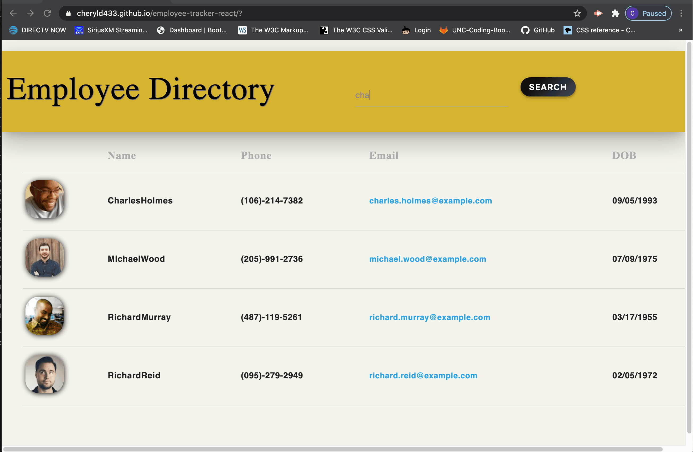

# EMPLOYEE DIRECTORY

## Description: 
In this assignment I created an employee directory with React. The requirements fr this assignment was to break up the application into UI components, manage component state, and respond to user events. The user will be able to view the entire employee directoroy, sort by name and search by name. 

## Table of Content:
  * [Installation](#installation)

  * [Usage](#usage)

  * [License](#license)

  * [Contributors](#contributors)

  * [Tests](#tests)

  * [Questions](#questions)

## Installation:
npm install, npm start

## Usage:
Live: https://cheryld433.github.io/employee-tracker-react/

## Contributors:
Cheryl Daniels

## Tests:

#### Questions:

